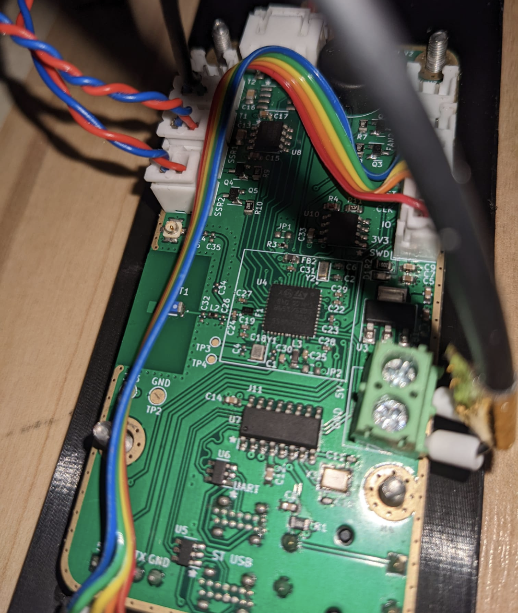
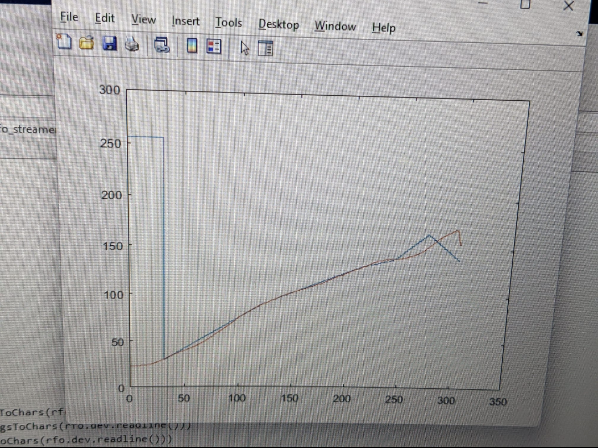

# smartReflow
## Repository for STM32WB55 based reflow toaster oven controller

The smartReflowV2 is a STm32WB55 based toaster oven reflow controller for reflowing PCBs at home. 

## Features
- 2 SSR outputs
- 2 cooling fan outputs
- 2 MAX31855 temperature ADCs
- Touch screen
- Bluetooth low energy, onboard chip antenna with matching
- 2 virtual com ports 
- MATLAB data streaming
- EEPROM for storing custom profiles
- PLA drying mode

## Assembly
The PCB was made by JLCPCB and assembled by hand.

## Results

