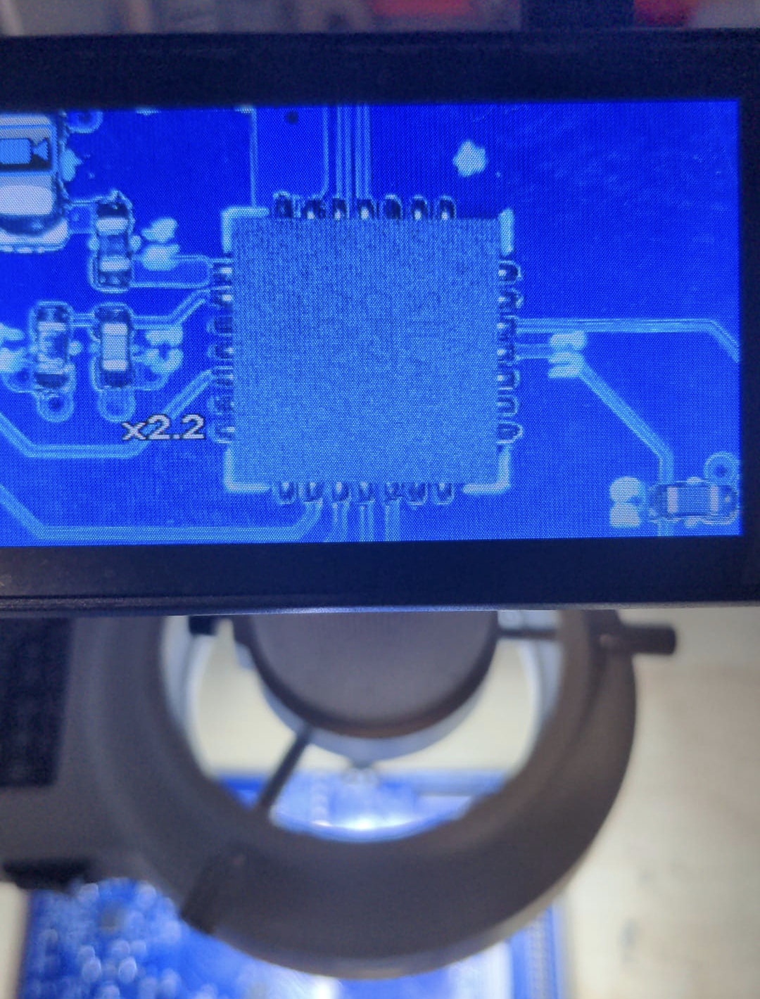

# smartReflow
## Repository for STM32WB55 based reflow toaster oven controller

The smartReflowV2 is a STm32WB55 based toaster oven reflow controller for reflowing PCBs at home. 

## Features
- 2 SSR outputs
- 2 cooling fan outputs
- 2 MAX31855 temperature ADCs
- Touch screen
- Bluetooth low energy, onboard chip antenna with matching
- 2 virtual com ports 
- MATLAB data streaming
- EEPROM for storing custom profiles
- PLA drying mode

## Assembly
The PCB was made by JLCPCB and assembled by hand.

## Results
The oven follows the desired temperature profile with only 5% of total error (Reflow state is a little bit delayed at the end).

QFN28 soldering results with 138 C paste profile. No need of rework had to be done.

Finished oven

## ToDos
- Bluetooth works, but an interface (i.e. app) is needed
- Firmware is hard to read
- PCB outline is too small (Nextion Display does not fit nicely onto it)
- EEPROM usage not implemented
- PID autotune code

## License
MIT